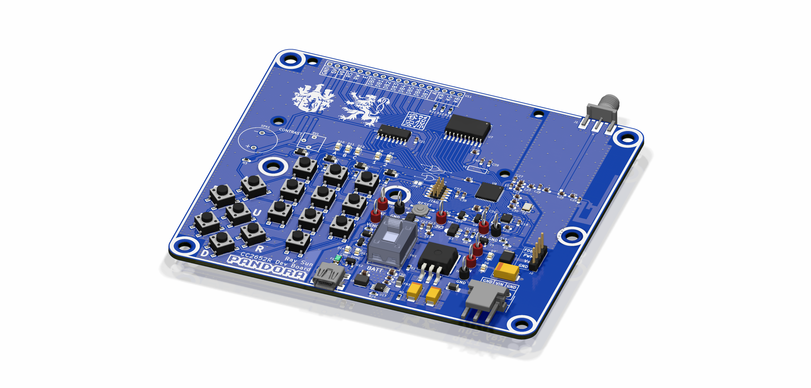
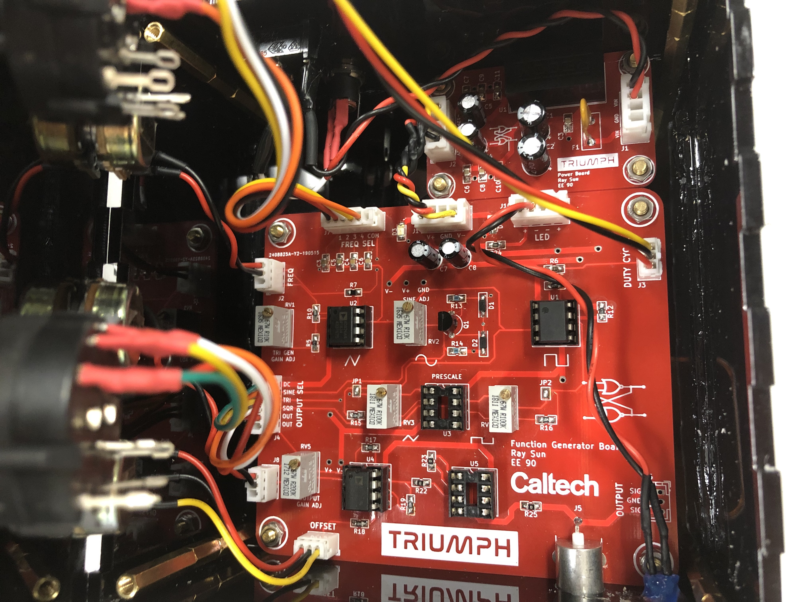
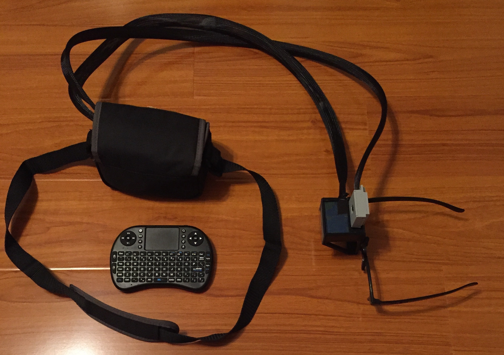
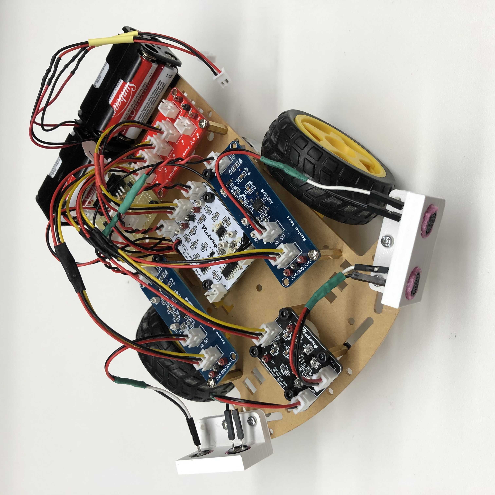
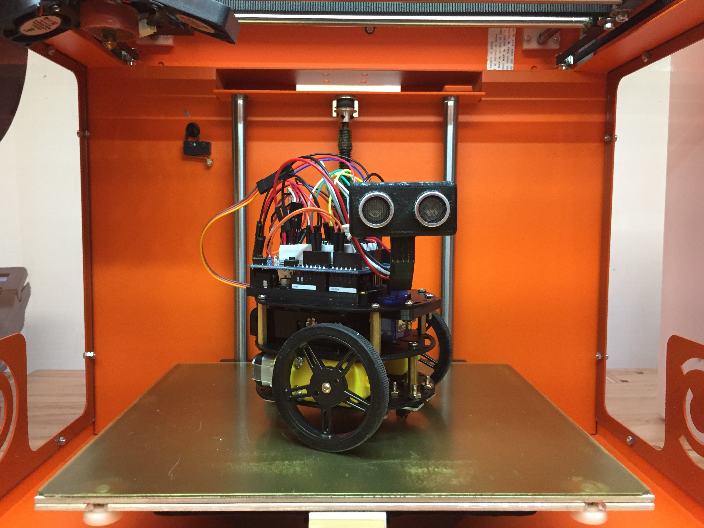

# Electronics

During my senior year at Caltech, I was asked to be the teaching assistant for a new advanced embedded systems project course, EE 110abc. The course focuses on high-performance and wireless embedded systems development, using the ARM Cortex-M4 architecture in a year-long project. The first quarter of the class covered hardware design and programming with the TI SimpleLink CC2652R multiprotocol dual-core ARM wireless MCU, while the second quarter focused on mesh networking with the TI BLE stack. [Pandora](https://github.com/ElectronicToast/pandora) is my implementation of a development board for the MCU as part of the second quarter, with an onboard inverted-F PCB antenna and an SMA jack for an external antenna. Unfortunately, COVID-19 halted all in-person lab work, and the clas was unable to finish our development boards. 

---

Build an analog function generator.

That was the task for the Analog Electronics Project Laboratory (EE 90) course at Caltech for Spring 2019. 

Aside from several minimum requirements - sine, square, and triangle waves over a minimum frequency range and with adjustible output amplitude - with the stipulation of no digital components in the signal path, I was pretty much given free reign. Other students produced designs that bristled with features or emphasized the accuracy of the signals. I created [Triumph](https://github.com/ElectronicToast/triumph) - an open source function generator that seeks to achieve the perfect balance between functionality, performance, and aesthetics. 

The base function generator circuitry consists of just four opamps, one comparator, two diodes, and one BJT. With several control knobs, the function generator can produce accurate waveforms over a wide range of frequencies and amplitudes. The square wave has an adjustible duty cycle.

I designed the enclosure in SolidWorks and produced it over the course of three days of fiddling around with laser cutter settings in the Caltech machine shop. White paint - regular old acrylic paint - does wonders when painted into engravings on black acrylic sheets.

---

I am a devotee of aesthetics. Mid junior year at Caltech, I learned that addressable LED strips existed, and I was hooked. I was attracted to the idea of visualizing music with LED strips, for example by analyzing audio with a Fourier transform and displaying the spectrum on LEDs. After a year of messing around with strips, I decided to make a PCB for a permanent LED fixture in my room, and [Bifrost](https://github.com/ElectronicToast/bifrost) was the result. This is a simple PCB that turns an Arduino Nano into a capable LED controller that can read audio from an audio jack or microphone module. I also implemented [OTA flashing](https://github.com/ElectronicToast/hc05-ota-adapter) of Arduinos using a common HC-05 Bluetooth module.

---

Back when I was at Caltech, I designed PCB leychains for several of the [student residences (Houses)](https://en.wikipedia.org/wiki/House_System_at_the_California_Institute_of_Technology), taking advantage of the extremely low cost of basic PCB fabrication in this day and age. These (top row) were simply boards with no components, with the logos of the Houses in exposed copper and silkscreen. Someone then gave me an idea: add programmable LEDs. So I designed [RuddBlink](https://github.com/ElectronicToast/ruddblink) (bottom row), which features an ATtiny85 MCU and eight LEDs on the same form factor. This was my first foray into bare metal programming outside of coursework; I wrote the [firmware](https://github.com/ElectronicToast/tinyblinkware) in C and established a cross-platform toolchain for updating the code. The keychain is coin cell powered and shockingly waterproof; I have a friend who washed theirs in the laundry and found it still working afterward. I graduated Caltech before I found the time to make a more capable version (perhaps STM32F0) with RGB LEDs.

---

I was involved in [Formula SAE at Caltech](http://fsae.caltech.edu/) while I was at Caltech, designing major subsystem components for the low voltage electrical system of our vehicle. This is our I/O Board from 2018, a STM32F4-based microprocessor system that reads analog input from the pedals of the vehicle and a current sensor on the motor, asserts fault conditions, and communicates with the rest of the low voltage system through CANBus. 

I designed the non-programmable fault hardware that interrupts power to the motors in the event that one of the more strigent fault conditions in FSAE occurs - if the motor current is high and the brake is pressed hard. In addition, I wrote firmware for reading the analog inputs and determining if the inputs constitute a fault.

As an alumni of the Caltech FSAE team, I attend design reviews and provide feedback on new generations of hardware designs for the electric vehicle.

---

It's rare to meet a hobbyist, electronics enthusiast, or EE/CS student these days who haven't worked with, or at least heard of, Arduino. But I suppose that not many of these folks have had the opportunity to work directly with AVR chips, with nothing separating you from the registers and I/O except for Assembly, or know what is truly happening under the hood. 

This is why I created [FIREFLY](https://github.com/ElectronicToast/FireFly), an open-source, Arduino-compatible ATmega8 target board. I have had the privilege of taking the digital electronics core class at Caltech, where microprocessor systems were taught from the ground up - from logic gates to counters to ALU design to [CPU emulators](https://github.com/ElectronicToast/Caltech10CPU). After that, we developed [AVR-based systems](https://github.com/ElectronicToast/BinarioBoard) while aware of the underlying logic, such as what makes Arduino `digitalWrite(ledPin)` turn on an LED and `Servo.write()` output a PWM signal. I created FIREFLY in order to have a tool for learning more about embedded systems development while sharpening my design skills.

---

This is a proof-of-concept of a wearable computer that doubles as an electronic vision-enhancing aid, powered by a Raspberry Pi and a 3D-printed transparent screen. I seek to turn this prototype into a lightweight, robust, and easy-to-use open-source project that anyone with severe visual impairments that are uncorrectable with surgery - or who just want an awesome wearable computer - can build for less than $100.

---

# Robots

Everyone has seen the Arduino robot that avoids obstacles with an ultrasonic sensor (I've built one too). How about one without any microprocessors? For the Experimental Projects in Electronic Circuits (EE 91) course at Caltech, I built this robot, which autonomously moves and avoids obstacles with no digital circuitry. Two pairs of ultrasonic transducers became a pair of ultrasonic sensors through an oscillator and a pair of sense amplifier circuits. A hardware PID controller implementation would compare the received sensor levels and adjust motor power to steer the robot away from obstacles.

---

More robots!

---

# 3D Printing

Check out my [Thingiverse profile](https://www.thingiverse.com/ElectronicToast/) for my portfolio of 3D prints!
