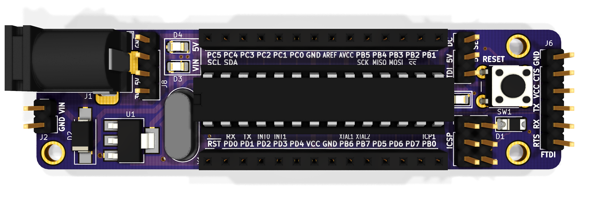

This is a collection of personal projects that I have worked on.

---

# Electronics

I have been involved in [Formula SAE at Caltech](http://fsae.caltech.edu/) for the past year and a half, designing major subsystem components for the low voltage electrical system of our vehicle. This is our I/O Board from last year, a STM32F4-based microprocessor system that reads analog input from the pedals of the vehicle and a current sensor on the motor, asserts fault conditions, and communicates with the rest of the low voltage system through CANBus. 

I designed the non-programmable fault hardware that interrupts power to the motors in the event that one of the more strigent fault conditions in FSAE occurs - if the motor current is high and the brake is pressed hard. In addition, I wrote firmware for reading the analog inputs and determining if the inputs constitute a fault.

---

It's rare to meet a hobbyist, electronics enthusiast, or EE/CS student these days who haven't worked with, or at least heard of, Arduino. Arduino is undoubtedly the world's most popular electronics prototyping platform, found in the toolbox of thousands of makers and students. But I suppose that not many of these folks have had the opportunity to work directly with AVR chips, with nothing separating you from the registers and I/O except for Assembly, or know what is truly happening under the hood. 

This is why I created [FIREFLY](https://github.com/ElectronicToast/FireFly), an open-source, Arduino-compatible ATmega8 target board. I have had the privilege of taking the digital electronics core class at Caltech, where microprocessor systems were taught from the ground up - from logic gates to counters to ALU design to [CPU emulators](https://github.com/ElectronicToast/Caltech10CPU). After that, we developed AVR-based systems while aware of the underlying logic, such as what makes Arduino `digitalWrite(ledPin)` turn on an LED and `Servo.write()` output a PWM signal. I created FIREFLY in order to have a tool for learning more about embedded systems development while sharpening my design skills.

---

I was born with a severe vision impairment that causes my eyeballs to oscillate in front of a deformed retina. While my condition is irrepairable through surgery, I have always believed in the  power of technology to augment my vision. I wanted to create a sort of open-source Google Glass that could allow me to function in college and in daily life without lugging around a pair of binoculars for whenever I wanted to read something far away - a sort of electronic vision enhancement. 

This is my proof-of-concept, powered by a Raspberry Pi and a 3D-printed transparent screen. I seek to turn this prototype into a lightweight, robust, and easy-to-use open-source project that anyone with similar visual impairments - or who just want an awesome wearable computer - can build for less than $100.

# 3D Printing

Check out my [Thingiverse profile](https://www.thingiverse.com/ElectronicToast/) for some random 3D prints that I've made!
